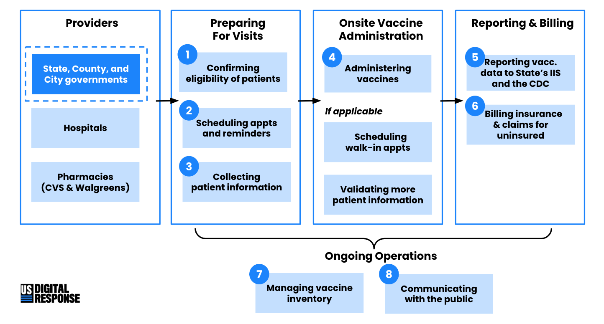

# Key Areas

We’ve identified 8 key areas for COVID-19 vaccine providers, based on our conversations with City, County, and State government teams who are responsible for administering vaccinations. Our focus is on the work needed for [open POD operations](https://www.cdc.gov/cpr/readiness/healthcare/closedPODtoolkit.htm#:~:text=Understanding%20Points%20of%20Dispensing,-Points%20of%20dispensing&text=Closed%20PODs%20are%20sites%20staffed,and%20should%20be%20used%20simultaneously). 

We see the high-level ecosystem in the following diagram:

### **Tips and Considerations**

For each of the 8 key focus areas illustrated above, we provide tips and considerations that we’ve heard from the government teams we’ve worked with. \(Got other tips, or need help on other parts of the vaccine ecosystem? Let [us know](mailto:vaccinations@usdigitalresponse.org)!\)

